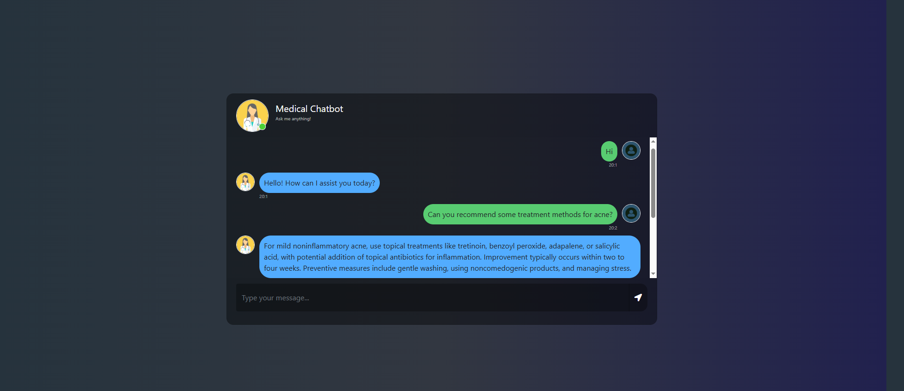

# MediBot — A Retrieval-Augmented Medical Q&A Chatbot

> An end-to-end RAG (Retrieval-Augmented Generation) application that answers medical questions grounded in a curated medical encyclopedia, deployed to AWS via a fully automated CI/CD pipeline.

[](https://www.python.org/)
[](https://www.langchain.com/)
[](https://openai.com/)
[](https://www.pinecone.io/)
[](https://flask.palletsprojects.com/)
[](https://www.docker.com/)
[](https://aws.amazon.com/)
[](https://github.com/features/actions)

---

## 📖 Table of Contents

1. [Motivation](#-motivation)
2. [Project Overview](#-project-overview)
3. [System Architecture](#-system-architecture)
4. [Tech Stack](#-tech-stack)
5. [How RAG Works in MediBot](#-how-rag-works-in-medibot)
6. [Project Structure](#-project-structure)
7. [Getting Started](#-getting-started)
8. [Configuration](#-configuration)
9. [Running the Application](#-running-the-application)
10. [Deployment (AWS + GitHub Actions)](#-deployment-aws--github-actions)
11. [Key Design Decisions](#-key-design-decisions)
12. [Limitations & Future Work](#-limitations--future-work)
13. [Disclaimer](#-disclaimer)
14. [Acknowledgements](#-acknowledgements)
15. [Author](#-author)

---

## 🎯 Motivation

Large Language Models hallucinate — and in the medical domain, hallucination is not a UX problem, it's a safety problem. A model that confidently invents a drug interaction or a dosage is worse than no model at all.

This project explores **Retrieval-Augmented Generation (RAG)** as a practical mitigation: instead of asking the LLM to recall medical facts from its parameters, we force it to ground every answer in passages retrieved from a trusted reference text. The model becomes a *reasoner over evidence*, not an *oracle*.

I built MediBot to gain hands-on experience with the full lifecycle of a production-style GenAI system — from chunking and embedding strategies, through prompt engineering, to containerization and cloud CI/CD.

---

## 🔍 Project Overview



MediBot is a web-based conversational agent that answers user questions about medical conditions, symptoms, and treatments. Every response is generated by GPT-4o conditioned on the top-*k* most semantically similar passages retrieved from a Pinecone vector index built over ***The Gale Encyclopedia of Medicine*** (a public-domain medical reference).

**What the user sees:** a clean chat interface where they can type a natural-language medical question and receive a context-grounded answer.

**What happens under the hood:**
- The query is embedded with a sentence-transformer
- The top-3 most similar document chunks are retrieved from Pinecone
- The chunks + query are stuffed into a carefully designed prompt
- GPT-4o generates an answer constrained to the retrieved context

---

## 🏗 System Architecture

```
                    ┌─────────────────────────────────────────────────┐
                    │                  INGESTION PIPELINE             │
                    │              (run once via store_index.py)      │
                    │                                                 │
   Medical PDF ───▶ │  PyPDFLoader ▶ Minimal-Doc Filter ▶             │
                    │  RecursiveCharacterTextSplitter ▶               │
                    │  HuggingFace Embeddings (MiniLM-L6, 384-dim) ▶  │
                    │  Pinecone Serverless Index                      │
                    └─────────────────────────────────────────────────┘
                                          │
                                          ▼
                    ┌─────────────────────────────────────────────────┐
                    │                INFERENCE PIPELINE               │
                    │                  (Flask app.py)                 │
                    │                                                 │
   User query ────▶ │  Embed query ▶ Pinecone similarity search       │
                    │  (top-k=3) ▶  Stuff retrieved docs into prompt  │
                    │  ▶ GPT-4o ▶ Answer                              │
                    └─────────────────────────────────────────────────┘
                                          │
                                          ▼
                                   Web UI (Flask + JS)

                    ┌─────────────────────────────────────────────────┐
                    │                 DEPLOYMENT                      │
                    │                                                 │
   git push ──────▶ │  GitHub Actions ▶ Docker build ▶                │
                    │  Push image to AWS ECR ▶                        │
                    │  Self-hosted runner on EC2 pulls & runs         │
                    └─────────────────────────────────────────────────┘
```

---

## 🧰 Tech Stack

| Layer | Technology | Why |
|---|---|---|
| **LLM** | OpenAI GPT-4o | Strong reasoning + instruction-following for grounded QA |
| **Embeddings** | `sentence-transformers/all-MiniLM-L6-v2` (384-dim) | Lightweight, fast, free, performant for semantic search |
| **Vector DB** | Pinecone (serverless, AWS us-east-1, cosine) | Managed, scalable, no infra to maintain |
| **Orchestration** | LangChain (`create_retrieval_chain`, `create_stuff_documents_chain`) | Battle-tested abstractions for RAG pipelines |
| **Backend** | Flask | Minimal footprint, perfect for a single-endpoint chat API |
| **Frontend** | HTML + CSS + jQuery | Simple, dependency-light chat UI |
| **Containerization** | Docker | Reproducible runtime, identical local & cloud behaviour |
| **Cloud** | AWS EC2 (compute) + ECR (image registry) | Industry-standard, generous free tier |
| **CI/CD** | GitHub Actions (self-hosted runner on EC2) | Push-to-deploy with zero manual ops |
| **Secrets** | `python-dotenv` locally, GitHub Secrets in CI | Keys never touch the repo |

---

## 🧠 How RAG Works in MediBot

### 1. Document Ingestion (`store_index.py`)

```
PDF ──▶ PyPDFLoader ──▶ Filter to {page_content, source} ──▶ 
RecursiveCharacterTextSplitter ──▶ Embed ──▶ Upsert to Pinecone
```

- The medical PDF is loaded page-by-page
- A `filter_to_minimal_docs` step strips noisy metadata, keeping only what's needed downstream
- Text is split using a recursive character splitter so chunks respect natural boundaries (paragraphs, sentences)
- Each chunk is embedded into a **384-dimensional dense vector** using MiniLM-L6
- Vectors are upserted into a Pinecone serverless index with **cosine similarity**

### 2. Query-Time Retrieval (`app.py`)

```python
retriever = docsearch.as_retriever(
    search_type="similarity",
    search_kwargs={"k": 3}
)
```

For every user message, we retrieve the **top-3 most similar chunks** from Pinecone.

### 3. Grounded Generation

The retrieved chunks and the user query are passed to GPT-4o through a `ChatPromptTemplate`:

```
System: "You are a medical assistant. Use ONLY the following context to 
         answer the question. If the answer is not in the context, say 
         you don't know. Keep answers concise (≤3 sentences)."
Context: {retrieved_docs}
Human:   {user_query}
```

This is the **stuff** chain: all retrieved documents are concatenated into a single prompt. It's simple and works well when *k* is small.

---

## 📂 Project Structure

```
MedicalChatBot/
├── .github/
│   └── workflows/
│       └── cicd.yaml              # GitHub Actions pipeline (build → ECR → EC2)
├── data/                          # Source medical PDF(s)
├── research/
│   └── trials.ipynb               # Jupyter notebooks — experimentation, ablations
├── src/
│   ├── __init__.py
│   ├── helper.py                  # PDF loader, splitter, embedding utilities
│   └── prompt.py                  # System prompt template
├── static/
│   └── style.css                  # Chat UI styling
├── templates/
│   └── chat.html                  # Chat interface
├── .gitignore
├── Dockerfile                     # Container image definition
├── README.md                      # ← you are here
├── app.py                         # Flask app + RAG inference chain
├── requirements.txt               # Python dependencies
├── setup.py                       # Local-package install (`pip install -e .`)
├── store_index.py                 # One-shot ingestion script
└── template.sh                    # Shell helper to scaffold project structure
```

---

## 🚀 Getting Started

### Prerequisites

- Python **3.10**
- A [Pinecone](https://www.pinecone.io/) account (free tier is sufficient)
- An [OpenAI](https://platform.openai.com/) API key with access to GPT-4o
- (Optional, for deployment) An AWS account with EC2 + ECR access

### 1. Clone the repository

```bash
git clone https://github.com/Krishna-yadu-048/MedicalChatBot.git
cd MedicalChatBot
```

### 2. Create and activate a Conda environment

```bash
conda create -n medibot python=3.10 -y
conda activate medibot
```

> `venv` works equally well — `python -m venv .venv && source .venv/bin/activate`.

### 3. Install dependencies

```bash
pip install -r requirements.txt
```

---

## 🔐 Configuration

Create a `.env` file in the project root:

```env
PINECONE_API_KEY="your_pinecone_api_key"
OPENAI_API_KEY="your_openai_api_key"
```

> ⚠️ `.env` is git-ignored — never commit secrets.

---

## ▶️ Running the Application

### Step 1 — Build the vector index (one-time setup)

```bash
python store_index.py
```

This loads the PDF(s) from `data/`, splits them into chunks, embeds each chunk with MiniLM-L6, and upserts everything into a Pinecone index named `medical-chatbot`. The index is created automatically if it doesn't exist (384 dims, cosine, serverless on AWS us-east-1).

### Step 2 — Launch the Flask app

```bash
python app.py
```

Open your browser at **http://localhost:8080** and start chatting.

---

## ☁️ Deployment (AWS + GitHub Actions)

The project ships with a complete push-to-deploy pipeline.

### Pipeline overview

```
┌─────────┐    ┌──────────┐    ┌─────────────┐    ┌──────────┐    ┌──────┐
│ git push│ ─▶ │  GitHub  │ ─▶ │ Docker build│ ─▶ │  AWS ECR │ ─▶ │ EC2  │
│  main   │    │  Actions │    │             │    │ (image)  │    │ (run)│
└─────────┘    └──────────┘    └─────────────┘    └──────────┘    └──────┘
```

### One-time setup

1. **IAM user** with policies:
   - `AmazonEC2ContainerRegistryFullAccess`
   - `AmazonEC2FullAccess`
2. **ECR repository** (e.g. `medicalbot`) — note the URI.
3. **EC2 instance** (Ubuntu) with Docker installed:
   ```bash
   curl -fsSL https://get.docker.com -o get-docker.sh
   sudo sh get-docker.sh
   sudo usermod -aG docker ubuntu
   newgrp docker
   ```
4. **Configure the EC2 instance as a self-hosted runner**: GitHub repo → *Settings → Actions → Runners → New self-hosted runner*.
5. **GitHub Secrets** (*Settings → Secrets and variables → Actions*):

   | Secret | Description |
   |---|---|
   | `AWS_ACCESS_KEY_ID` | IAM user access key |
   | `AWS_SECRET_ACCESS_KEY` | IAM user secret key |
   | `AWS_DEFAULT_REGION` | e.g. `us-east-1` |
   | `ECR_REPO` | Full ECR URI |
   | `PINECONE_API_KEY` | Pinecone key |
   | `OPENAI_API_KEY` | OpenAI key |

After this, every push to `main` triggers a fresh build, pushes the image to ECR, and the EC2 runner pulls and restarts the container. Don't forget to open inbound port **8080** on the EC2 security group.

---

## 🧪 Key Design Decisions

| Decision | Rationale |
|---|---|
| **Open-source embeddings instead of OpenAI's** | MiniLM-L6 is free, runs locally, and is competitive on retrieval benchmarks. Using OpenAI for embeddings *and* generation would double API costs without a clear quality win for this domain. |
| **Pinecone over self-hosted FAISS / Chroma** | Wanted to learn a managed vector store. Trades a small monthly cost for zero ops and built-in persistence. |
| **`k=3` retrieval** | Empirically, 3 chunks gave the best balance: enough context to answer fully without diluting relevance or blowing the token budget. |
| **`stuff` chain over `map_reduce` / `refine`** | With small *k* and ~500-token chunks, stuffing fits comfortably in GPT-4o's context window — simpler, faster, cheaper, no quality loss. |
| **Strict system prompt** | Instructs the model to answer *only* from context and to admit ignorance, reducing hallucination. |
| **Self-hosted runner on EC2** | Avoids the awkward auth dance of pushing from a hosted runner to an EC2 instance, and keeps the deployment surface minimal. |

---

## 🚧 Limitations & Future Work

This is a portfolio project, not a clinical product. Honest list of what's missing and what I'd build next:

- **No conversational memory** — each query is independent. Adding `ConversationalRetrievalChain` with chat history (and history-aware query rewriting) is the obvious next step.
- **Single retrieval strategy** — pure dense retrieval. Hybrid (BM25 + dense) with a cross-encoder reranker would likely improve precision on rare medical terms.
- **No evaluation harness** — I'd build a RAGAS / TruLens evaluation suite measuring faithfulness, answer relevance, and context precision on a held-out QA set.
- **Single source document** — production systems would index multiple peer-reviewed sources (PubMed, NICE guidelines, etc.) with provenance shown in the UI.
- **No citation surfacing** — the model uses retrieved context but doesn't show users *which* passages it grounded its answer in. Adding source citations would massively improve trust.
- **No streaming** — responses arrive all at once. Switching to `stream=True` would dramatically improve perceived latency.
- **No user authentication or rate limiting** — fine for a demo, not for anything public.
- **No observability** — I'd add LangSmith / Langfuse tracing to debug retrieval quality in production.

---

## ⚠️ Disclaimer

**MediBot is an educational project. It is not a medical device, not certified, and must not be used to diagnose, treat, or make decisions about real medical conditions.** Always consult a qualified healthcare professional. The author accepts no liability for use of this software.


